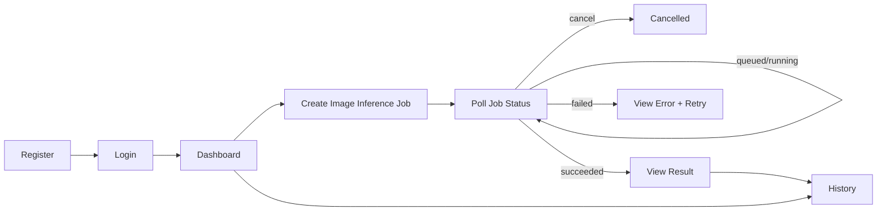
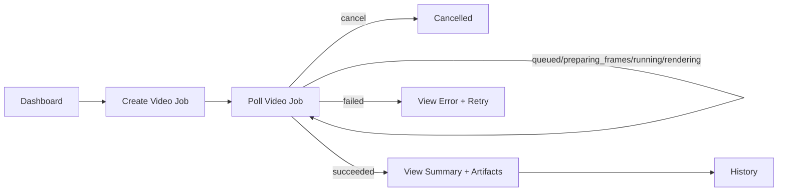

# Low-Fidelity Wireframes and User Flows

These are low-fidelity planning artifacts aligned to current MVP behavior and planned post-MVP video support.

## Primary User Flow (Current MVP)

## Planned Video Flow (Post-MVP)

## Page Wireframes

### 1) Login Page

    +------------------------------------------------+
    | Road Damage Defect System   [Theme: Light/Dark]|
    |------------------------------------------------|
    | Email: [___________________________]           |
    | Password: [________________________]           |
    | [ Login ]                                      |
    | New user? [ Go to Register ]                   |
    +------------------------------------------------+

### 2) Register Page

    +------------------------------------------------+
    | Create Account              [Theme: Light/Dark]|
    |------------------------------------------------|
    | Email: [___________________________]           |
    | Password: [________________________]           |
    | Confirm: [_________________________]           |
    | [ Register ]                                   |
    | Already have account? [ Login ]                |
    +------------------------------------------------+

### 3) Dashboard

    +--------------------------------------------------------------+
    | Top Nav: Dashboard | Image Inference | History | Logout      |
    |                                   [Theme: Light/Dark]        |
    |--------------------------------------------------------------|
    | Welcome, <email>                                             |
    | [ Start Image Inference ]   [ View History ]                 |
    +--------------------------------------------------------------+

### 4) Image Inference Page (Async Job Flow)

    +--------------------------------------------------------------------------------+
    | Model: [ rddc2020-imsc-last95 v ]                                              |
    | Upload Image: [ Choose File ]                                                   |
    | [ Submit Job ]                                                                  |
    |--------------------------------------------------------------------------------|
    | Job Panel                                                                       |
    | Job ID: 5f6e...                                                                 |
    | Status: queued -> running -> succeeded/failed/cancelled                        |
    | Elapsed: 00:00                                                                  |
    | [ Cancel Job ] (while queued/running)                                           |
    |--------------------------------------------------------------------------------|
    | Result Panel (on succeeded)                                                     |
    | [ Annotated Image Preview ]                                                     |
    | Detections table                                                                 |
    +--------------------------------------------------------------------------------+

States:

- Empty: no file selected.
- Queued: job accepted, waiting for worker.
- Running: polling in progress.
- Cancelled: user cancellation confirmed.
- Succeeded: render result image and detections.
- Failed: show engine/job error and retry option.

### 5) History Page

    +------------------------------------------------------------------------------------------------+
    | Filters: [Model v] [Sort By: time|id|name v] [Order: asc|desc v] [Page size: 10|20|50 v]     |
    |------------------------------------------------------------------------------------------------|
    | Card Title: <original filename>                                                                |
    | Job ID: <id>                                                                                   |
    | Model: <display name or model_id fallback>                                                     |
    | Status: succeeded/failed/cancelled                                                             |
    | Actions: [Open Result] [Delete]                                                                |
    +------------------------------------------------------------------------------------------------+

### 6) Planned Video Inference Page (Phase 4A)

    +---------------------------------------------------------------------------------------------------+
    | Model: [ orddc2024-phase2-ensemble v ]                                                            |
    | Upload Video: [ Choose File ] [sample_fps: 2 v]                                                   |
    | [ Submit Video Job ]                                                                               |
    |---------------------------------------------------------------------------------------------------|
    | Job Panel                                                                                          |
    | Job ID: vid-123...                                                                                 |
    | Status: queued -> preparing_frames -> running -> rendering -> succeeded/failed/cancelled          |
    | [ Cancel Job ] (while queued/preparing_frames/running/rendering)                                  |
    |---------------------------------------------------------------------------------------------------|
    | Result Panel (on succeeded)                                                                        |
    | Summary: frames processed / detections / labels                                                    |
    | [ Annotated video preview ] [Frame result list]                                                    |
    +---------------------------------------------------------------------------------------------------+

## UX Rules to Keep Consistent

- Show selected model and current job status clearly.
- Preserve selected model across manual refresh.
- Keep polling interval and timeout behavior predictable and documented.
- Every failure state must show a readable error with retry guidance.
- Cancellation must have a dedicated state message distinct from failure.
- Theme preference should persist across login/register/protected pages.

Planned video UX rules:

- Video page must show pipeline stage labels (`preparing_frames`, `running`, `rendering`) explicitly.
- Video default model should prioritize throughput (`orddc2024-phase2-ensemble`).
- Streaming (Phase 4B) should be optional and not remove async video fallback.
