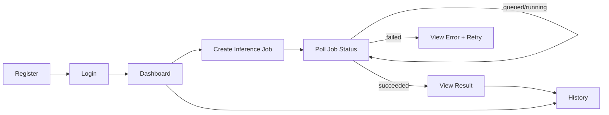

# Low-Fidelity Wireframes and User Flows

These are low-fidelity planning artifacts for implementation alignment.

## Primary User Flow

## Page Wireframes

### 1) Login Page

    +------------------------------------------------+
    | Road Damage Defect System                      |
    |------------------------------------------------|
    | Email: [___________________________]           |
    | Password: [________________________]           |
    | [ Login ]                                      |
    | New user? [ Go to Register ]                   |
    +------------------------------------------------+

### 2) Register Page

    +------------------------------------------------+
    | Create Account                                 |
    |------------------------------------------------|
    | Email: [___________________________]           |
    | Password: [________________________]           |
    | Confirm: [_________________________]           |
    | [ Register ]                                   |
    | Already have account? [ Login ]                |
    +------------------------------------------------+

### 3) Dashboard

    +--------------------------------------------------------------+
    | Top Nav: Dashboard | Image Inference | History | Logout      |
    |--------------------------------------------------------------|
    | Welcome, <email>                                             |
    | [ Start Image Inference ]   [ View History ]                 |
    +--------------------------------------------------------------+

### 4) Image Inference Page (Async Job Flow)

    +--------------------------------------------------------------------------------+
    | Model: [ rddc2020-imsc-last95 v ]                                              |
    | Upload Image: [ Choose File ]                                                   |
    | [ Submit Job ]                                                                  |
    |--------------------------------------------------------------------------------|
    | Job Panel                                                                       |
    | Job ID: 5f6e...                                                                 |
    | Status: queued -> running -> succeeded/failed                                   |
    |--------------------------------------------------------------------------------|
    | Result Panel (on succeeded)                                                     |
    | [ Annotated Image Preview ]                                                     |
    | Detections table                                                                 |
    +--------------------------------------------------------------------------------+

States:

- Empty: no file selected.
- Queued: job accepted, waiting for worker.
- Running: polling in progress.
- Succeeded: render result image and detections.
- Failed: show engine/job error and retry option.

### 5) History Page

    +------------------------------------------------------------------------------------------------+
    | Filters: [Model v] [Status v] [Date Range]                                                     |
    |------------------------------------------------------------------------------------------------|
    | Timestamp           | Model ID                 | Status    | Defects | Action                  |
    | 2026-03-22 09:31    | rddc2020-imsc-last95     | succeeded | 3       | [Open Result]           |
    | 2026-03-22 09:05    | rddc2020-imsc-ensemble...| failed    | -       | [View Error]            |
    +------------------------------------------------------------------------------------------------+

## UX Rules to Keep Consistent

- Show selected model ID and current job status clearly.
- Keep polling interval and timeout behavior predictable and documented.
- Every failure state must show a readable error with retry guidance.
- Preserve last selected model for convenience in session.