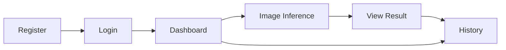

# Low-Fidelity Wireframes and User Flows

These are low-fidelity planning artifacts for implementation alignment. They are intentionally simple and can be upgraded to high-fidelity design later.

## Primary User Flow

## Page Wireframes

### 1) Login Page

    +------------------------------------------------+
    | Road Damage Defect System                      |
    |------------------------------------------------|
    | Email: [___________________________]           |
    | Password: [________________________]           |
    | [ Login ]                                      |
    | New user? [ Go to Register ]                   |
    +------------------------------------------------+

States:
- Loading: disable inputs, show spinner in button.
- Error: show inline credential error.
- Success: redirect to dashboard.

### 2) Register Page

    +------------------------------------------------+
    | Create Account                                 |
    |------------------------------------------------|
    | Email: [___________________________]           |
    | Password: [________________________]           |
    | Confirm: [_________________________]           |
    | [ Register ]                                   |
    | Already have account? [ Login ]                |
    +------------------------------------------------+

States:
- Error for invalid email format, weak password, and mismatch.
- Success leads to login page with success message.

### 3) Dashboard

    +--------------------------------------------------------------+
    | Top Nav: Dashboard | Image Inference | History | Logout      |
    |--------------------------------------------------------------|
    | Welcome, <email>                                             |
    |                                                              |
    | [ Start Image Inference ]   [ View History ]                 |
    +--------------------------------------------------------------+

### 4) Image Inference Page

    +---------------------------------------------------------------------+
    | Top Nav                                                             |
    |---------------------------------------------------------------------|
    | Model: [ yolov8n v ]                                                |
    | Upload Image: [ Choose File ]                                       |
    | [ Run Inference ]                                                   |
    |---------------------------------------------------------------------|
    | Result Panel                                                        |
    | [ Annotated Image Preview ]                                         |
    | Detections:                                                         |
    | - crack (0.92) bbox [x1,y1,x2,y2]                                  |
    | - pothole (0.84) bbox [x1,y1,x2,y2]                                |
    +---------------------------------------------------------------------+

States:
- Empty: no upload yet.
- Loading: show progress message and disable run button.
- Error: invalid file, model unavailable, server error.
- Success: render image and detections table.

### 5) History Page

    +--------------------------------------------------------------------------------+
    | Filters: [Model v] [Date Range] [Search]                                       |
    |--------------------------------------------------------------------------------|
    | Timestamp           | Model      | Defects | Confidence Max | Action           |
    | 2026-03-21 10:31    | yolov8n    | 3       | 0.92           | [Open Result]    |
    | 2026-03-21 09:05    | custom-v1  | 1       | 0.88           | [Open Result]    |
    +--------------------------------------------------------------------------------+

States:
- Empty history illustration with call-to-action to run inference.
- Error state with retry.

## UX Rules to Keep Consistent

- Show currently selected model near upload controls at all times.
- Preserve last selected model in UI session state for convenience.
- Every API error must render a human-readable message and a technical code for support.
- Loading and retry states are mandatory on all pages with network calls.